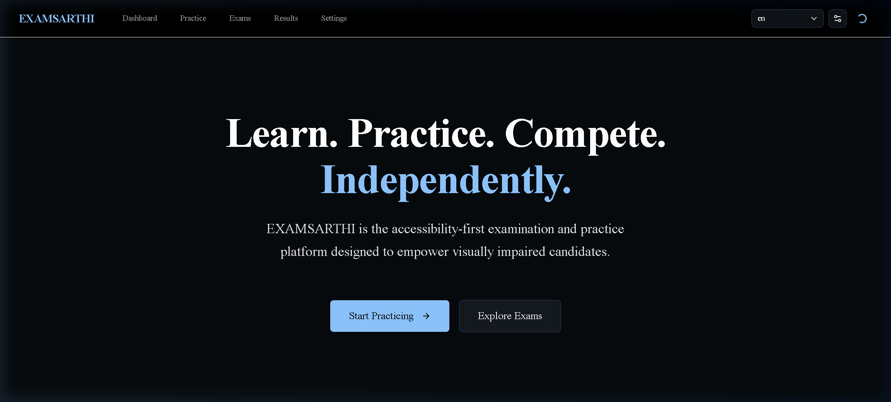
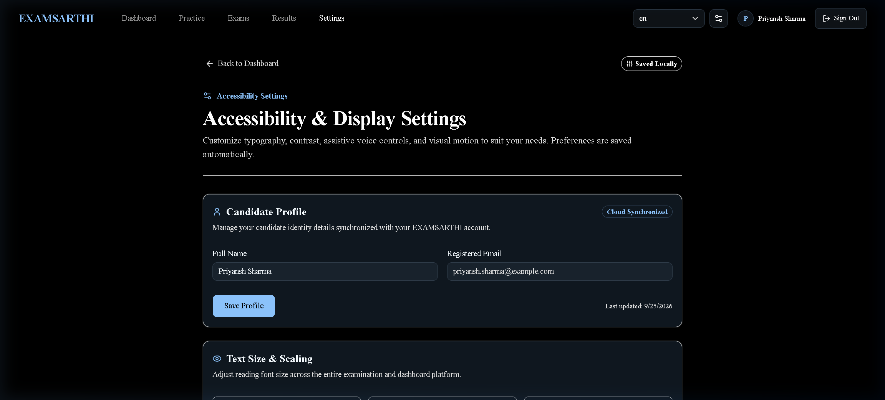
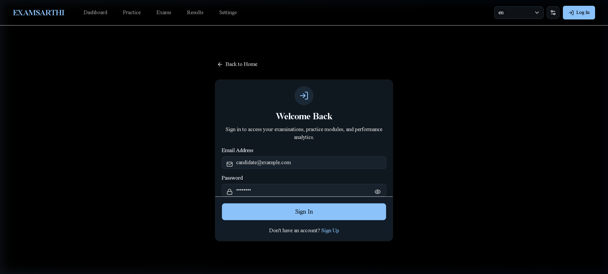
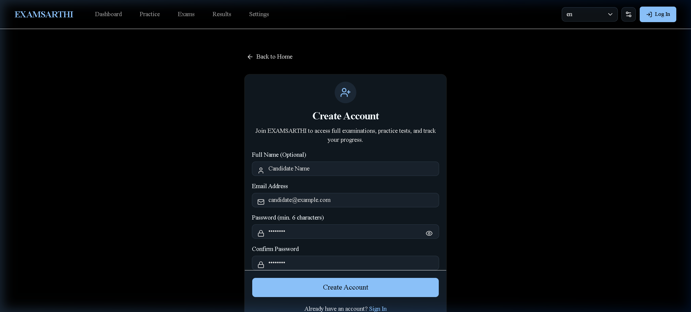
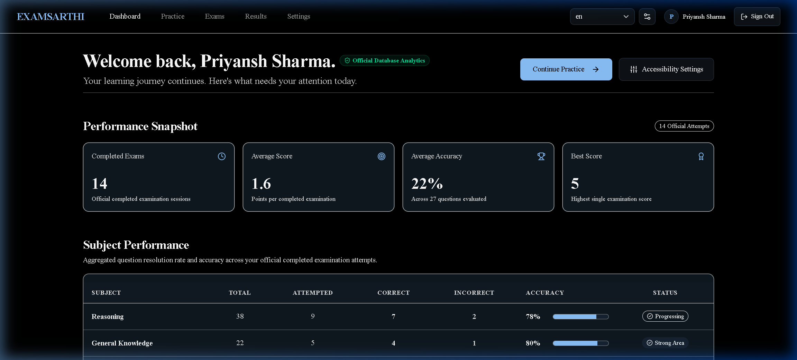
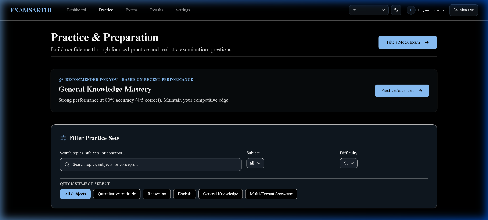
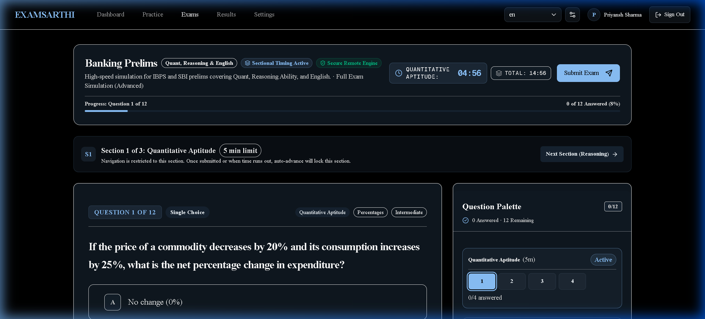
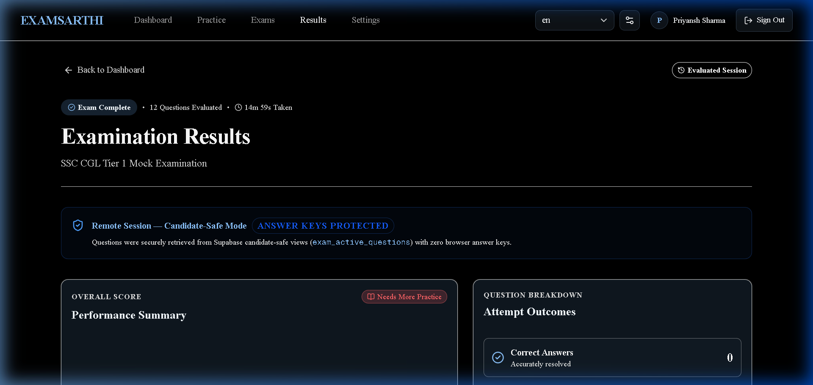

# EXAMSARTHI — Complete Platform Visual Showcase

This document provides a complete walkthrough and screenshots of all 8 core pages of **EXAMSARTHI**, an accessibility-first, server-evaluated competitive examination platform.

---

## 1. Landing Page (/)

Entry point presenting accessibility features, keyboard navigation cues, dual language toggle, and WCAG AA contrast compliance.

---

## 2. Accessibility Settings (/settings)

Centralized accessibility accommodations: Text Scaling (16px, 18px, 20px), Theme Selection (Light, Dark, High-Contrast), Audio Assistance, and Cloud Profile Name synchronization.

---

## 3. Candidate Sign In (/login)

Accessible sign-in workflow with Supabase cookie SSR authentication, keyboard focus indicators, and accessible error handling.

---

## 4. Candidate Registration (/signup)

Candidate account creation with full name, password guidelines, and seamless onboarding to Supabase candidate profiles.

---

## 5. Candidate Performance Dashboard (/dashboard)

Real-time performance analytics directly synchronized with Supabase PostgreSQL attempts: Total Completed Attempts, Average Score, Accuracy Rate, Subject Breakdown, and Weak-Topic Recommendations.

---

## 6. Practice Sets Hub (/practice)

Interactive question practice library with real-time multi-facet filters (Subject pills, search query, difficulty), question count/duration metadata, and accessible empty state resets.

---

## 7. Timed Sectional Examination Engine (/exam?exam=e2)

Accessible examination interface showing Sectional Timing Active badges, section-specific countdown clocks, secure remote question delivery with zero answer keys exposed, bilingual Voice Examination Panel (EN/HI), and responsive Question Palette.

---

## 8. Official Results & Question Review (/results)

Comprehensive performance breakdown with official server-evaluated score, percentage accuracy, time used, weak topic diagnostic badges, and full question-by-question review with official explanations.

---

