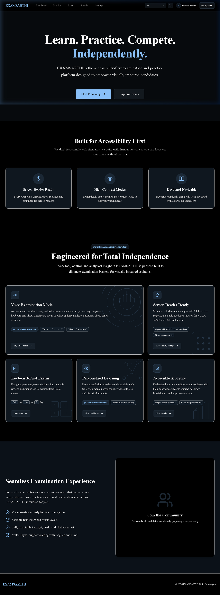
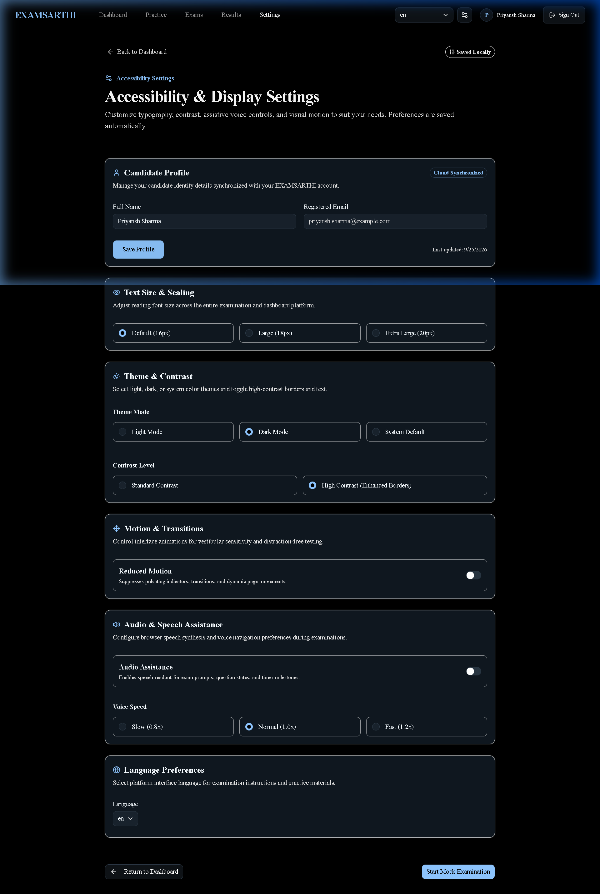
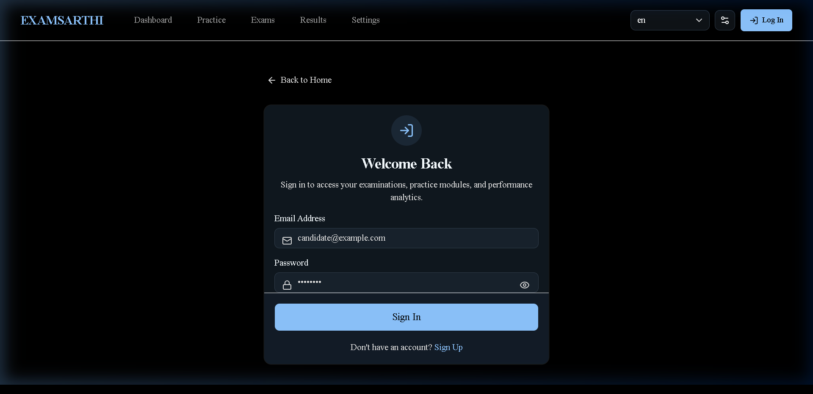
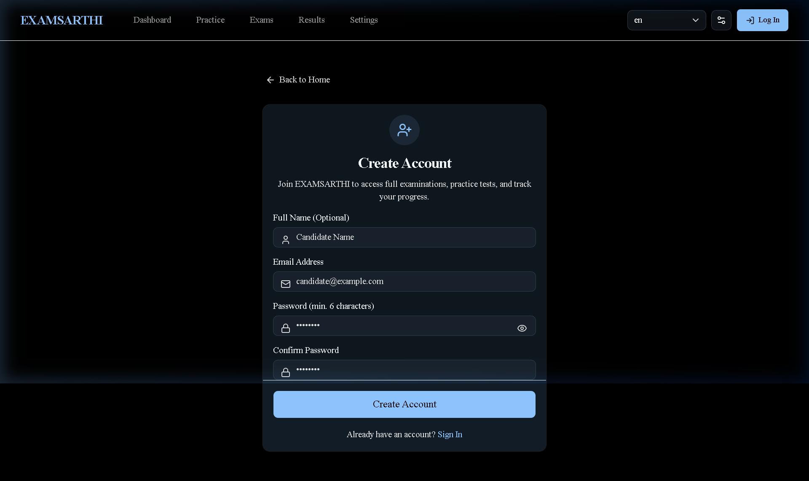
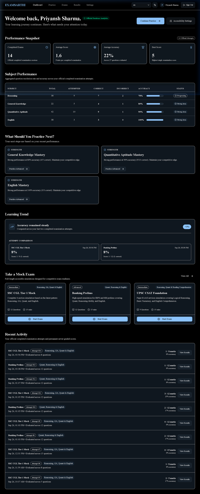
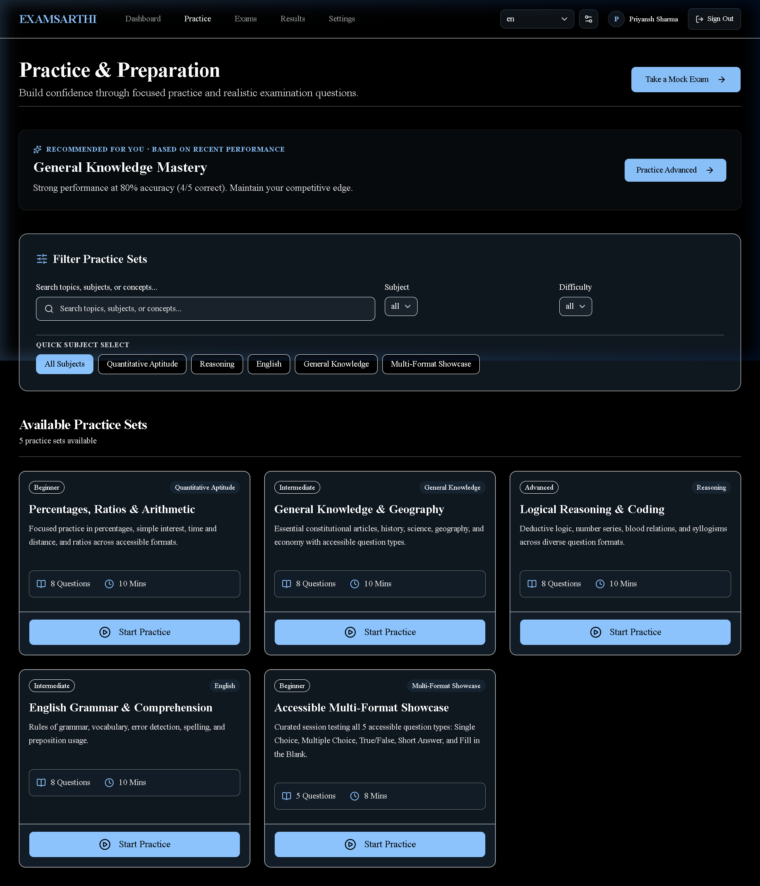
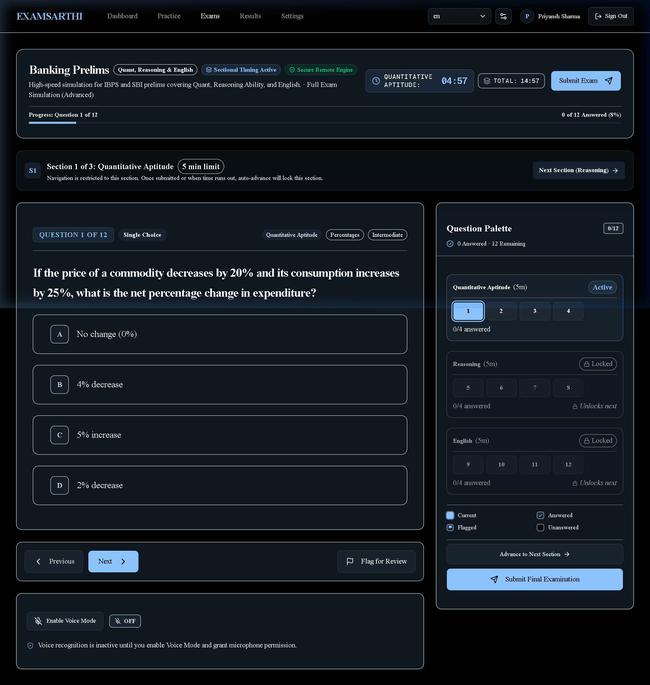
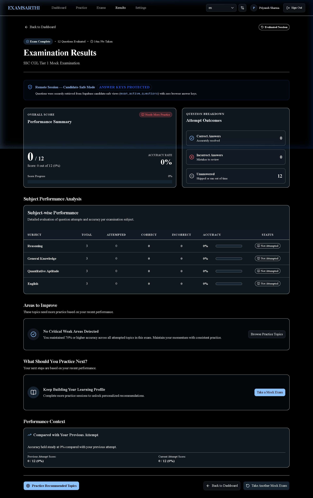

# EXAMSARTHI — Complete Platform Visual Showcase

This document provides a complete walkthrough and screenshots of all 8 core pages of **EXAMSARTHI**, an accessibility-first, server-evaluated competitive examination platform.

---

## 1. Landing Page (/)

Redesigned visual identity: warm background palette, Lora serif typography, Academic Caspian Teal CTA hierarchy, live exam question simulation card, and zero AI-agent debug clutter.

---

## 2. Accessibility Settings (/settings)

Clean header navigation with debug badges removed; centralized accessibility accommodations: Text Scaling (16px, 18px, 20px), Theme Selection (Light, Dark, High-Contrast), Audio Assistance, and Cloud Profile Name synchronization.

---

## 3. Candidate Sign In (/login)

Accessible sign-in workflow with institutional brand anchor, Lora serif headline, rounded-2xl elevation, and clear field focus indicators.

---

## 4. Candidate Registration (/signup)

Candidate account creation with institutional framing, password guidelines, and seamless onboarding to Supabase candidate profiles.

---

## 5. Candidate Performance Dashboard (/dashboard)

Average Score elevated into a dominant hero stat card; debug pills removed; subject performance indicators converted to subtle colored dots with clean row hover states.

---

## 6. Practice Sets Hub (/practice)

Interactive question practice library with serif headers, multi-facet subject filters with refined active states, and full keyboard accessibility.

---

## 7. Timed Sectional Examination Engine (/exam?exam=e2)

High-elevation question card as primary visual focus; palette and timers softened to secondary visual weight; debug badges removed; serif question statements with accessible radio groups.

---

## 8. Official Results & Question Review (/results)

Visual dominance established on overall score and percentage; debug banners removed; subtle server verification indicator; refined subject table and question-by-question review.

---

